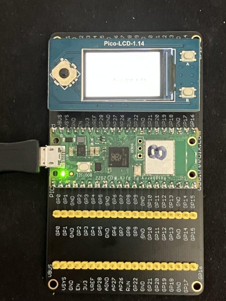
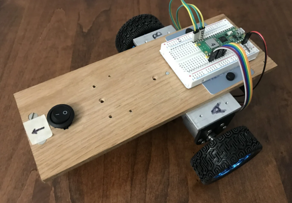
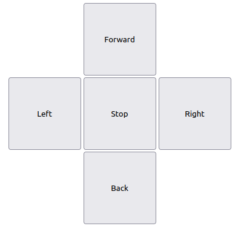

# TeleOperated PicoBot using Bluetotooth (BLE) communication between two Pico-W devices

* Implementation of Kevin McAleer's [Bluetooth remote controlled robot tutorial](https://www.kevsrobots.com/blog/bluetooth-remote.html) but with the following variations:
    * For the remote control (which is the Bluetooth server), I will use a [Pico LCD 1.14](https://www.waveshare.com/wiki/Pico-LCD-1.14) device instead of the Pimoroni Display device used by Kevin
    * For the robot (which will be the Bluetooth client), I will use my own PicoBot instead of Kevin's BurgerBot
* Kevin's tutorial does a nice job of explaining all the impoortant details, so I won't attempt to improve on them here.

## The [Remote](https://www.waveshare.com/wiki/Pico-LCD-1.14) Control:

## The [PicoBot](https://github.com/dblanding/Pico-MicroPython-smart-car):

## To operate:
1. Power-up the Remote
2. Turn on the PicoBot
3. Use **A** button to increase speed, **B** button to decrease speed
4. Use joystick control to control PicoBot movement.

